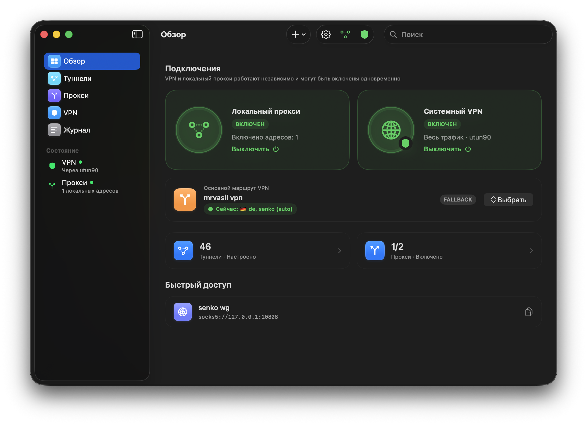
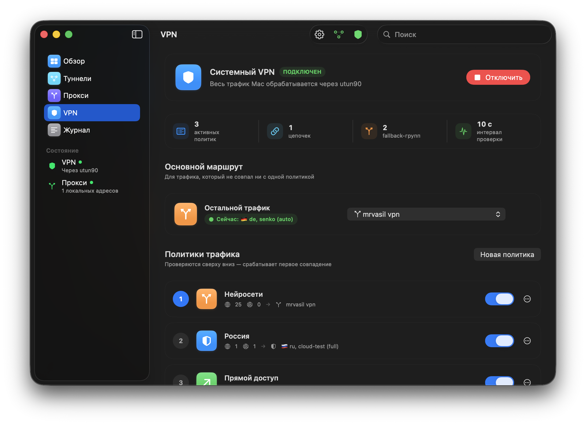

<p align="center">
  
</p>

<h1 align="center">Waypoint</h1>

<p align="center">
  <strong>Route every Mac connection with intent.</strong><br>
  A native VPN and local proxy client built for flexible routes, fast recovery,
  and everyday control.
</p>

<p align="center">
  
  
  
  
  <a href="LICENSE"></a>
</p>

---

Waypoint brings system-wide VPN, per-app proxy endpoints, traffic policies,
tunnel chains, and automatic failover into one focused macOS app. Add a link,
a WireGuard profile, or a subscription; then decide exactly where traffic goes.

<table>
  <tr>
    <td width="60%" valign="middle">
      <a href="docs/screenshots/dashboard.png">
        
      </a>
    </td>
    <td width="40%" valign="middle">
      <h3>Everything connected, at a glance</h3>
      <p><strong>VPN + proxy</strong><br>Run them independently or together.</p>
      <p><strong>Live route</strong><br>See the active fallback exit immediately.</p>
      <p><strong>Native control</strong><br>Use the app, menu bar, or <kbd>⌘ ⇧ V</kbd>.</p>
    </td>
  </tr>
  <tr>
    <td width="40%" valign="middle">
      <h3>Routing without guesswork</h3>
      <p><strong>First-match policies</strong><br>Domains, CIDRs, GeoSite, and GeoIP.</p>
      <p><strong>Composable routes</strong><br>Tunnels, multi-hop chains, Direct, or Block.</p>
      <p><strong>Smart fallback</strong><br>Connect immediately, then select the best healthy route.</p>
    </td>
    <td width="60%" valign="middle">
      <a href="docs/screenshots/vpn-routing.png">
        
      </a>
    </td>
  </tr>
</table>

## Quick start

```bash
brew install xray
git clone https://github.com/mrvasil/Waypoint.git
cd Waypoint
make install
```

Launch the app:

```bash
open -a Waypoint
```

The first system VPN connection asks for an administrator password once. Waypoint
installs a narrow privileged service for `utun` and route management; later launches
reuse it without asking again.

## The routing model

```text
                                      ┌─ Direct
Mac ──► Waypoint ──► first-match rules ├─ Block
                    │                 ├─ Tunnel
                    │                 ├─ WG ──► VLESS       (chain)
                    │                 └─ WG / VLESS / chain (fallback)
                    │
                    ├─ System VPN ───────────────► all Mac traffic
                    └─ SOCKS5 / HTTP :10808 ────► selected apps
```

Rules are evaluated from top to bottom. Traffic that does not match a policy uses
the main VPN route. Local proxies have their own route profiles and can run at the
same time as the system VPN.

### Built for network changes

Waypoint keeps the `utun` interface and fail-closed routes in place while Wi-Fi,
Ethernet, or a phone hotspot changes underneath it. Xray is rebound to the new
physical path only after that path is ready, so traffic does not briefly escape
through the normal default route.

WireGuard peers receive persistent keepalive, fallback decisions use hysteresis,
and ordinary route changes are applied through Xray's local API without restarting
the data plane.

## Supported connections

### Tunnels and subscriptions

| Input | Support |
|---|---|
| WireGuard | Full `wg-quick` profile with one or more peers |
| VLESS | TCP, WebSocket, gRPC, HTTPUpgrade, XHTTP, TLS, Reality, Vision |
| VMess | v2rayN base64 JSON |
| Trojan | URI import with TLS defaults |
| Shadowsocks | SIP002 and base64 URI forms |
| Upstream proxy | `socks://` and `http://` |
| Subscription | Plain or base64 link list, grouped and refreshed every 15 minutes |

### Local endpoints

- SOCKS5 with UDP support
- HTTP proxy
- Loopback-only or LAN listening
- Optional username and password
- A separate route profile for every endpoint

## Everyday workflow

1. Add tunnel links, a WireGuard config, or a subscription URL.
2. Open **VPN** and choose a tunnel, chain, or fallback group as the main route.
3. Add first-match policies for domains, networks, GeoSite, or GeoIP lists.
4. Turn on the system VPN, local proxies, or both from the dashboard or menu bar.

Tunnel latency appears next to each route as soon as its individual check finishes.
Subscription nodes stay grouped under their source instead of becoming an unstructured
list.

<details>
<summary><strong>How system VPN works</strong></summary>

Waypoint creates a macOS `utun` interface and two more-specific IPv4/IPv6 routes.
The embedded helper passes TCP and UDP packets to Xray's TUN inbound. Xray itself
runs as the signed-in user; only interface and route lifecycle operations stay in
the restricted root service.

The service validates every file, user, interface, argument, and executable path.
If a candidate Xray configuration fails, Waypoint restores the last confirmed one.
If Xray exits unexpectedly, the helper attempts recovery before removing protected
routes.

ICMP is not supported by Xray's TUN implementation, so the system `ping` command is
not a VPN connectivity test. TCP and UDP traffic are supported.

</details>

<details>
<summary><strong>How tunnel chains and fallback work</strong></summary>

A chain lists hops from the Mac to the final exit. For example, `WG SE → VLESS NL`
means the VLESS connection is established through WireGuard.

A fallback group may contain tunnels and reusable chains. The first candidate is
available immediately during startup. Background observations then choose a healthy
route within the configured latency threshold. A new selection must be confirmed,
and one transient probe failure does not move traffic to another route.

If every candidate fails, the group either blocks traffic or uses Direct according
to its explicit final action. It never silently changes to Direct.

</details>

<details>
<summary><strong>How physical network bypass works</strong></summary>

Without an explicit egress interface, a full-tunnel VPN can route Xray's own outbound
sockets back into the same `utun`. Waypoint avoids that loop by binding outbound
sockets to the active physical interface with `IP_BOUND_IF` and routing DNS through
the same protected path.

The interface is selected from macOS Network Service Order instead of the current
default route, which may already point at a VPN. You can disable this behavior or
choose an interface manually in Settings.

</details>

## Development

Requires macOS 15+, Swift 6, Command Line Tools, and Xray.

```bash
make build     # debug build
make run       # launch from source
make test      # deterministic parser, routing, migration, and runtime checks
make live      # live Xray and tunnel verification
make app       # signed build/Waypoint.app bundle
make install   # install into /Applications
```

Useful focused checks:

```bash
swift run waypoint-tests --live-latency
swift run waypoint-tests --validate-hot-routing
swift run waypoint-tests --validate-routing
swift run waypoint-vpn-lifecycle-tests
.build/debug/WaypointVPNLauncher --self-test
```

### Project map

```text
Sources/Waypoint/                  SwiftUI app and state model
Sources/WaypointCore/              parsers, Xray config, routing, persistence
Sources/WaypointVPNHelper/         privileged utun and route lifecycle
Sources/WaypointVPNLauncher/       one-time service installer and IPC client
Sources/WaypointVPNLifecycle/      transactional Xray reload state machine
Sources/WaypointTests/             deterministic and live checks
Resources/                         app icon sources
```

Persistent state is stored in `~/Library/Application Support/Waypoint/state.json`.
On first launch, Waypoint copies the previous app's state automatically and leaves
the original untouched as a fallback.

## Current limitations

- Subscription import accepts plain or base64 link lists, not Clash YAML.
- Hysteria2 and TUIC are not available because they are not Xray protocols.
- Local builds use ad-hoc signing; Developer ID packaging and a DMG are not included yet.
- System VPN uses a restricted LaunchDaemon rather than Network Extension, so it does
  not appear as a separate profile in System Settings → VPN.

## License

Waypoint is available under the [MIT License](LICENSE).

---

<p align="center">
  Built for people who want routing to stay understandable when the network is not.
</p>
